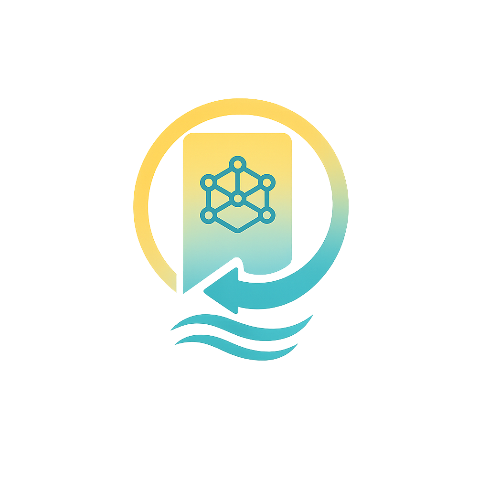

# DaySave - Save Your Social Media Moments

<div align="center">
  
  <h3>Organize, analyze, and share content from 11 social platforms</h3>
</div>

## 🎨 Brand Colors

- **Primary Blue**: `#2596be` - Main brand color
- **Light Teal**: `#a1d8c9` - Secondary brand color  
- **Bright Yellow**: `#fbda6a` - Accent color
- **Light Green**: `#d8e2a8` - Success color
- **Light Yellow**: `#f0e28b` - Warning color
- **Teal**: `#87c0a9` - Info color
- **Gold**: `#fbce3c` - Danger/highlight color
- **Dark Teal**: `#309b9c` - Dark variant
- **Sage Green**: `#bfcc8d` - Light variant

## 🚀 Features

- **11 Social Platforms**: Facebook, YouTube, Instagram, TikTok, WeChat, Messenger, Telegram, Snapchat, Pinterest, Twitter/X, WhatsApp
- **AI-Powered Analysis**: Content summarization, sentiment analysis, auto-tagging
- **Smart Contacts**: Apple iPhone-compatible contact management with relationships and groups
- **Multilingual Support**: English, German, French, Italian, Spanish
- **Enterprise Security**: 2FA, encryption, device fingerprinting
- **Modern UI**: Bootstrap 5 with custom gradient styling

## 🛠 Setup Instructions

### Prerequisites
- Node.js 18+ 
- Docker and Docker Compose
- MySQL 8.0 (or use Docker)

### 1. Clone and Install Dependencies
```bash
git clone <repository-url>
cd daysave_v1.4.1
npm install
```

### 2. Configure Environment
```bash
# Create .env file with the following variables:
cp .env.example .env
# Edit .env with your actual values
```

**Required Environment Variables:**
```bash
# App Configuration
NODE_ENV=development
APP_PORT=3000

# Database Configuration (Docker)
DB_HOST=db
DB_PORT=3306
DB_NAME=daysave_v141
DB_USER=daysave
DB_USER_PASSWORD=your-secure-password
DB_ROOT_USER=root
DB_ROOT_PASSWORD=your-secure-password

# Google Cloud Configuration (for production)
GCLOUD_PROJECT_ID=your-project-id
GCLOUD_REGION=us-central1
GCLOUD_SQL_INSTANCE=daysave-sql-instance
GCLOUD_SQL_CONNECTION_NAME=your-project-id:us-central1:daysave-sql-instance

# JWT Configuration
JWT_SECRET=your-super-secret-jwt-key-change-in-production
JWT_REFRESH_SECRET=your-super-secret-refresh-key-change-in-production

# OAuth Configuration
GOOGLE_CLIENT_ID=your-google-client-id
GOOGLE_CLIENT_SECRET=your-google-client-secret
APPLE_CLIENT_ID=your-apple-client-id
APPLE_TEAM_ID=your-apple-team-id
APPLE_KEY_ID=your-apple-key-id
APPLE_PRIVATE_KEY=your-apple-private-key
MICROSOFT_CLIENT_ID=your-microsoft-client-id
MICROSOFT_CLIENT_SECRET=your-microsoft-client-secret

# Email Configuration
SENDGRID_API_KEY=your-sendgrid-api-key
FROM_EMAIL=noreply@daysave.app

# File Upload Configuration
MAX_FILE_SIZE=10485760
ALLOWED_FILE_TYPES=image/jpeg,image/png,image/gif,application/pdf,text/plain

# Security Configuration
BCRYPT_ROUNDS=12
SESSION_SECRET=your-session-secret-change-in-production
```

### 3. OAuth Provider Setup

**Google OAuth Setup:**
1. Go to [Google Cloud Console](https://console.cloud.google.com/)
2. Create a new project or select existing one
3. Enable Google+ API
4. Go to "Credentials" → "Create Credentials" → "OAuth 2.0 Client IDs"
5. Set Application Type to "Web application"
6. Add authorized redirect URIs:
   - `http://localhost:3000/auth/google/callback` (development)
   - `https://your-domain.com/auth/google/callback` (production)
7. Copy Client ID and Client Secret to your .env file

**Microsoft OAuth Setup:**
1. Go to [Azure Portal](https://portal.azure.com/)
2. Register a new application
3. Set redirect URI to:
   - `http://localhost:3000/auth/microsoft/callback` (development)
   - `https://your-domain.com/auth/microsoft/callback` (production)
4. Copy Application (client) ID and create a client secret
5. Add to your .env file

**Apple OAuth Setup:**
1. Go to [Apple Developer Console](https://developer.apple.com/)
2. Create an App ID with Sign In with Apple capability
3. Create a Services ID for your domain
4. Generate a private key and download the .p8 file
5. Note your Team ID, Key ID, and Client ID
6. Add all values to your .env file

### 4. Database Setup with Docker

**Option A: Using Docker (Recommended)**
```bash
# Start the application with Docker Compose
docker-compose up -d

# Wait for database to initialize (about 10-15 seconds)
sleep 15

# Run database migrations
docker-compose exec app sh -c "DB_HOST=db DB_USER=daysave DB_USER_PASSWORD=your-password DB_NAME=daysave_v141 DB_PORT=3306 npx sequelize-cli db:migrate"

# Check migration status
docker-compose exec app sh -c "DB_HOST=db DB_USER=daysave DB_USER_PASSWORD=your-password DB_NAME=daysave_v141 DB_PORT=3306 npx sequelize-cli db:migrate:status"
```

**Option B: Local MySQL Setup**
```bash
# Install and configure MySQL locally
# Create database: daysave_v141
# Create user: daysave with appropriate permissions

# Run migrations locally
npx sequelize-cli db:migrate

# Check migration status
npx sequelize-cli db:migrate:status
```

### 5. Verify Database Setup
```bash
# Check if all tables were created (22 tables total)
docker-compose exec db mysql -u daysave -p daysave_v141 -e "SHOW TABLES;"

# Expected output should include:
# - users, roles, permissions, role_permissions
# - user_devices, audit_logs, social_accounts
# - content, files, contacts, contact_groups
# - content_groups, share_logs, login_attempts
# - and 8 more tables...
```

### 6. Start Development Server

**With Docker:**
```bash
# Application will be available at http://localhost:3000
docker-compose up -d
```

**Without Docker:**
```bash
npm run dev
```

## 📁 Project Structure

```
daysave_v1.4.1/
├── app.js                 # Main application file
├── package.json
├── .env                   # Environment variables
├── docker-compose.yml     # Docker configuration
├── Dockerfile            # Docker image definition
├── config/               # Configuration files
│   └── config.js        # Sequelize database config
├── models/               # Sequelize models
│   ├── index.js         # Model associations
│   ├── user.js          # User model
│   ├── role.js          # Role model
│   └── ...              # 20+ other models
├── migrations/           # Database migrations
│   ├── 20250626150501-create-roles.js
│   ├── 20250626150502-create-permissions.js
│   └── ...              # 20+ migration files
├── views/                # EJS templates
│   ├── index.ejs        # Landing page
│   ├── login.ejs        # Login page
│   ├── register.ejs     # Registration page
│   ├── dashboard.ejs    # User dashboard
│   ├── contacts.ejs     # Contacts management
│   ├── terms.ejs        # Terms of trade
│   ├── privacy.ejs      # Privacy policy
│   └── contact.ejs      # Contact form
├── public/               # Static assets
│   ├── images/          # Logo and images
│   ├── css/             # Custom stylesheets
│   └── js/              # Client-side JavaScript
├── locales/             # Translation files
│   ├── en.json          # English translations
│   ├── de.json          # German translations
│   └── ...
├── routes/               # Express routes
├── docs/                 # Documentation
│   └── er-diagram.puml  # Database ER diagram
└── logs/                # Application logs
```

## 🗄️ Database Strategy

- **Approach**: Sequelize CLI Migrations (not automatic sync)
- **Environment Variables**: Standardized on `DB_USER_PASSWORD` (not `DB_PASSWORD`)
- **Migration Order**: 22 migrations in correct dependency order
- **Tables Created**: 22 tables with proper foreign key relationships
- **UUID Usage**: All primary keys and foreign keys use CHAR(36) UUIDs

**Database Commands:**
```bash
# Run migrations
npx sequelize-cli db:migrate

# Check migration status
npx sequelize-cli db:migrate:status

# Undo last migration
npx sequelize-cli db:migrate:undo

# Undo all migrations
npx sequelize-cli db:migrate:undo:all
```

## 🎨 Logo Usage

### Navbar Brand
```html
<a class="navbar-brand" href="/">
    
    DaySave
</a>
```

### Hero Section
```html
<div class="text-center">
    
    <h1>DaySave</h1>
</div>
```

## 🌈 CSS Custom Properties

```css
:root {
    --primary-color: #2596be;
    --secondary-color: #a1d8c9;
    --accent-color: #fbda6a;
    --success-color: #d8e2a8;
    --warning-color: #f0e28b;
    --info-color: #87c0a9;
    --danger-color: #fbce3c;
    --dark-color: #309b9c;
    --light-color: #bfcc8d;
    
    --gradient-hero: linear-gradient(135deg, #fbda6a, #a1d8c9, #2596be);
    --gradient-primary: linear-gradient(135deg, #2596be, #309b9c);
}
```

## 🔧 Development Scripts

- `npm run dev` - Start development server with hot reload
- `npm run test` - Run test suite
- `npm run lint` - Run ESLint
- `docker-compose up -d` - Start with Docker
- `docker-compose down` - Stop Docker containers
- `docker-compose logs -f app` - View application logs

## 🚀 Deployment

### Google Cloud App Engine
```bash
gcloud app deploy
```

### Docker Production
```bash
docker build -t daysave-app .
docker run -p 3000:3000 --env-file .env daysave-app
```

## 🐳 Docker Configuration

The application uses Docker Compose for easy development setup:

**docker-compose.yml:**
- **daysave-app**: Node.js application container
- **daysave-db**: MySQL 8.0 database container
- **Ports**: App on 3000, MySQL on 3306
- **Volumes**: Persistent database storage

**Dockerfile:**
- Based on Node.js 18 Alpine
- Non-root user for security
- Production-ready configuration

## Deployment: Google App Engine & Cloud SQL

1. **Set up Cloud SQL (MySQL) instance**
   - Create a Cloud SQL instance in your Google Cloud project.
   - Note the instance connection name (e.g., `your-project:region:instance`).
   - Set root/user passwords and database name to match your .env.

2. **Configure `app.yaml`**
   - Edit `app.yaml` and set `cloud_sql_instances` to your instance connection name.
   - Ensure `env_variables` match your DB credentials.

3. **Enable Cloud SQL Admin API**
   - In Google Cloud Console, enable the Cloud SQL Admin API.

4. **Deploy to App Engine**
   ```sh
   gcloud app deploy
   ```
   - App will be available at `https://<your-project-id>.appspot.com`

5. **Cloud SQL Connection**
   - App Engine connects to Cloud SQL using the `cloud_sql_instances` setting in `app.yaml`.
   - No need to run the Cloud SQL Proxy in App Engine standard environment.

6. **Environment Variables**
   - You can override or add more variables in `app.yaml` as needed.

For more details, see [Google App Engine Node.js docs](https://cloud.google.com/appengine/docs/standard/nodejs/runtime) and [Cloud SQL docs](https://cloud.google.com/sql/docs/mysql/connect-app-engine).

## 🐛 Troubleshooting

### Database Connection Issues
- Ensure `DB_HOST=db` for Docker setup
- Verify `DB_USER_PASSWORD` is set correctly (not `DB_PASSWORD`)
- Check that MySQL container is running: `docker-compose ps`

### Migration Issues
- If migrations fail, check the migration status: `npx sequelize-cli db:migrate:status`
- Clear migration state if needed: `TRUNCATE TABLE SequelizeMeta;`
- Rebuild Docker image if migration files are outdated: `docker-compose build --no-cache`

### Docker Issues
- Rebuild containers: `docker-compose down && docker-compose build --no-cache && docker-compose up -d`
- Check logs: `docker-compose logs -f app`

## 📝 License

MIT License - see LICENSE file for details

## 🤝 Contributing

1. Fork the repository
2. Create your feature branch (`git checkout -b feature/amazing-feature`)
3. Commit your changes (`git commit -m 'Add amazing feature'`)
4. Push to the branch (`git push origin feature/amazing-feature`)
5. Open a Pull Request

## 📞 Support

- Email: support@daysave.app
- Documentation: [docs.daysave.app](https://docs.daysave.app)
- Issues: [GitHub Issues](https://github.com/daysave/daysave-app/issues)

---

<div align="center">
  Made with ❤️ by the DaySave Team
</div>

## Google Maps Autocomplete Integration

The contact form uses Google Maps Places Autocomplete for address fields. This works for both initial and dynamically added address fields using robust selector logic.

### Setup Instructions
- **API Key:** Set your Google Maps API key in the `.env` file as `GOOGLE_MAPS_KEY=your_key_here`.
- **Required APIs:** Enable both the Maps JavaScript API and Places API in your Google Cloud Console.
- **CSP:** Ensure your Content Security Policy allows scripts from `https://maps.googleapis.com` and `https://maps.gstatic.com`.
- **Selector Logic:** The code uses multiple selector strategies to guarantee all address fields are found and initialized, regardless of naming or rendering order. If you change the address input naming convention, update the selector logic in `public/js/contact-maps-autocomplete.js`.
- **Dynamic Fields:** The autocomplete initialization is robust and will work for both initial and dynamically added address fields.

### Troubleshooting
- If autocomplete does not work, check the browser console for errors.
- Ensure the API key is valid and unrestricted for localhost during development.
- If you add new field types or change naming, update the selector logic accordingly.
