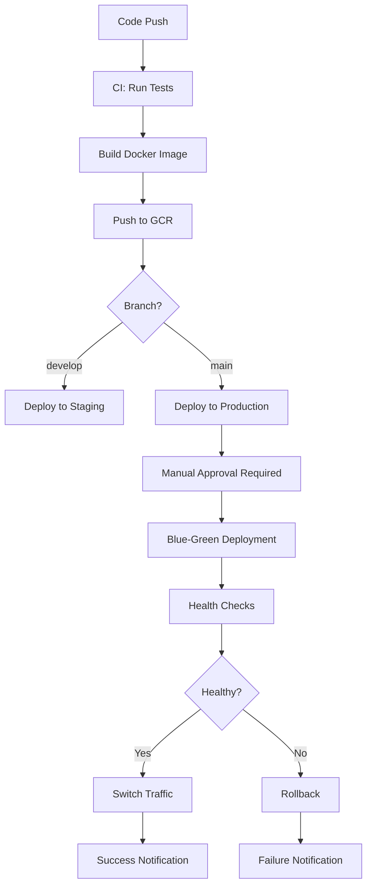

# GitHub Actions CI/CD Pipeline Setup Guide

## Overview

This guide will help you set up a complete CI/CD pipeline for the DaySave project using GitHub Actions. The pipeline includes automated testing, Docker image building, and blue-green deployment to Google Cloud Platform.

## Pipeline Features

- ✅ **Automated Testing**: Comprehensive test suite with MySQL database
- ✅ **Docker Build & Push**: Multi-stage production builds pushed to GCR
- ✅ **Blue-Green Deployment**: Zero-downtime deployments to GCP
- ✅ **Security Scanning**: Vulnerability scanning with Trivy
- ✅ **Environment Management**: Separate staging and production environments
- ✅ **Health Checks**: Comprehensive application health validation
- ✅ **Rollback Capability**: Automatic rollback on deployment failures

## Prerequisites

### 1. Google Cloud Platform Setup

Ensure you have:
- GCP Project: `daysave-v1412` (or update in workflow)
- Service Account with necessary permissions
- VM instances configured for production/staging
- Container Registry enabled

### 2. GitHub Repository Access

You need admin access to your GitHub repository to:
- Add repository secrets
- Configure environments
- Enable Actions (if not already enabled)

## Step 1: Configure GitHub Repository Secrets

Go to your GitHub repository → Settings → Secrets and variables → Actions

Add the following **Repository Secrets**:

### Core Authentication
```
GOOGLE_APPLICATION_CREDENTIALS
```
**Value**: Base64 encoded GCP service account JSON key
```bash
# Generate this value:
cat path/to/your-service-account.json | base64 -w 0
```

### Database Configuration
```
DB_USER_PASSWORD=your_strong_database_password
DB_ROOT_PASSWORD=your_strong_root_password
REDIS_PASSWORD=your_redis_password
```

### API Keys & External Services
```
OPENAI_API_KEY=sk-your-openai-api-key
GOOGLE_MAPS_API_KEY=your-google-maps-api-key
```

### OAuth Configuration
```
GOOGLE_CLIENT_ID=your-google-oauth-client-id
GOOGLE_CLIENT_SECRET=your-google-oauth-client-secret
MICROSOFT_CLIENT_ID=your-microsoft-oauth-client-id
MICROSOFT_CLIENT_SECRET=your-microsoft-oauth-client-secret
```

### Email Configuration
```
GMAIL_USER=your-gmail-address@gmail.com
GMAIL_PASS=your-gmail-app-password
GMAIL_FROM=noreply@your-domain.com
```

### Application Configuration
```
SESSION_SECRET=your-strong-session-secret-min-32-chars
JWT_SECRET=your-jwt-secret-key
JWT_REFRESH_SECRET=your-jwt-refresh-secret-key
BASE_URL=https://your-domain.com
ALLOWED_ORIGINS=https://your-domain.com,https://www.your-domain.com
WEBAUTHN_RP_ID=your-domain.com
```

### Google Cloud Configuration
```
GOOGLE_CLOUD_STORAGE_BUCKET=your-storage-bucket-name
```

## Step 2: Configure GitHub Environments

### Create Production Environment
1. Go to Settings → Environments
2. Click "New environment"
3. Name: `production`
4. Configure protection rules:
   - ✅ Required reviewers (add yourself)
   - ✅ Wait timer: 0 minutes
   - ✅ Restrict pushes to protected branches

### Create Staging Environment
1. Create another environment named `staging`
2. No protection rules needed (auto-deploy)

## Step 3: Update Configuration Files

### Update Project ID (if different)
If your GCP project ID is not `daysave-v1412`, update these files:
- `.github/workflows/ci-cd-pipeline.yml` (line 13)
- `scripts/deploy-production.sh` (line 12)

### Update Domain Configuration
Replace placeholder domains in:
- `docker-compose.production.yml`
- `nginx/sites-available/daysave.conf`
- Environment variables in workflow

## Step 4: Verify GCP Service Account Permissions

Your service account needs these IAM roles:
```
- Compute Admin
- Container Registry Service Agent
- Cloud SQL Admin (if using Cloud SQL)
- Storage Admin
- Service Account User
```

## Step 5: Test the Pipeline

### Trigger CI Pipeline
```bash
# Create a test branch and push
git checkout -b test-ci-pipeline
echo "# Testing CI/CD" >> README.md
git add README.md
git commit -m "test: trigger CI/CD pipeline"
git push origin test-ci-pipeline
```

### Create Pull Request
1. Create PR from `test-ci-pipeline` to `main`
2. Watch the CI pipeline run
3. Verify all tests pass

### Deploy to Staging
```bash
# Push to develop branch
git checkout develop
git merge test-ci-pipeline
git push origin develop
```

### Deploy to Production
```bash
# Push to main branch (requires approval)
git checkout main
git merge develop
git push origin main
```

## Step 6: Monitor Deployment

### Check Pipeline Status
- Go to Actions tab in GitHub
- Monitor running workflows
- Check logs for any issues

### Verify Deployment
```bash
# Check application health
curl -f https://your-domain.com/health

# Check database connectivity
curl -f https://your-domain.com/api/health/db

# Check file upload functionality
curl -f https://your-domain.com/api/health/storage
```

## Pipeline Workflow



## Troubleshooting

### Common Issues

#### 1. Authentication Errors
```
Error: Failed to authenticate with Google Cloud
```
**Solution**: Verify `GOOGLE_APPLICATION_CREDENTIALS` secret is correctly base64 encoded

#### 2. Database Connection Failures
```
Error: connect ECONNREFUSED 127.0.0.1:3306
```
**Solution**: Check database credentials and ensure MySQL service is healthy

#### 3. Docker Build Failures
```
Error: failed to solve: process "/bin/sh -c npm ci" didn't complete successfully
```
**Solution**: Check package.json and ensure all dependencies are available

#### 4. Deployment Timeouts
```
Error: Deployment timed out waiting for health check
```
**Solution**: Increase health check timeout or investigate application startup issues

### Debug Commands

```bash
# Check workflow logs
gh run list
gh run view <run-id>

# SSH into production VM
gcloud compute ssh daysave-production --zone=asia-southeast1-a

# Check container logs
docker-compose -f docker-compose.production.yml logs app

# Check container health
docker-compose -f docker-compose.production.yml ps
```

## Security Best Practices

1. **Secrets Management**: Never commit secrets to repository
2. **Environment Isolation**: Use separate environments for staging/production
3. **Access Control**: Limit who can approve production deployments
4. **Audit Trail**: Monitor all deployment activities
5. **Vulnerability Scanning**: Regular security scans of Docker images

## Maintenance

### Regular Tasks
- Update dependencies monthly
- Review and rotate secrets quarterly
- Monitor deployment metrics
- Update base Docker images

### Scaling Considerations
- Add horizontal pod autoscaling
- Implement database read replicas
- Add CDN for static assets
- Consider multi-region deployment

## Next Steps

After successful setup:
1. Configure monitoring and alerting
2. Set up log aggregation
3. Implement automated backups
4. Add performance testing
5. Configure disaster recovery

## Support

If you encounter issues:
1. Check GitHub Actions logs
2. Review GCP Console logs
3. Verify all secrets are configured
4. Test individual components manually
5. Consult the troubleshooting section above
