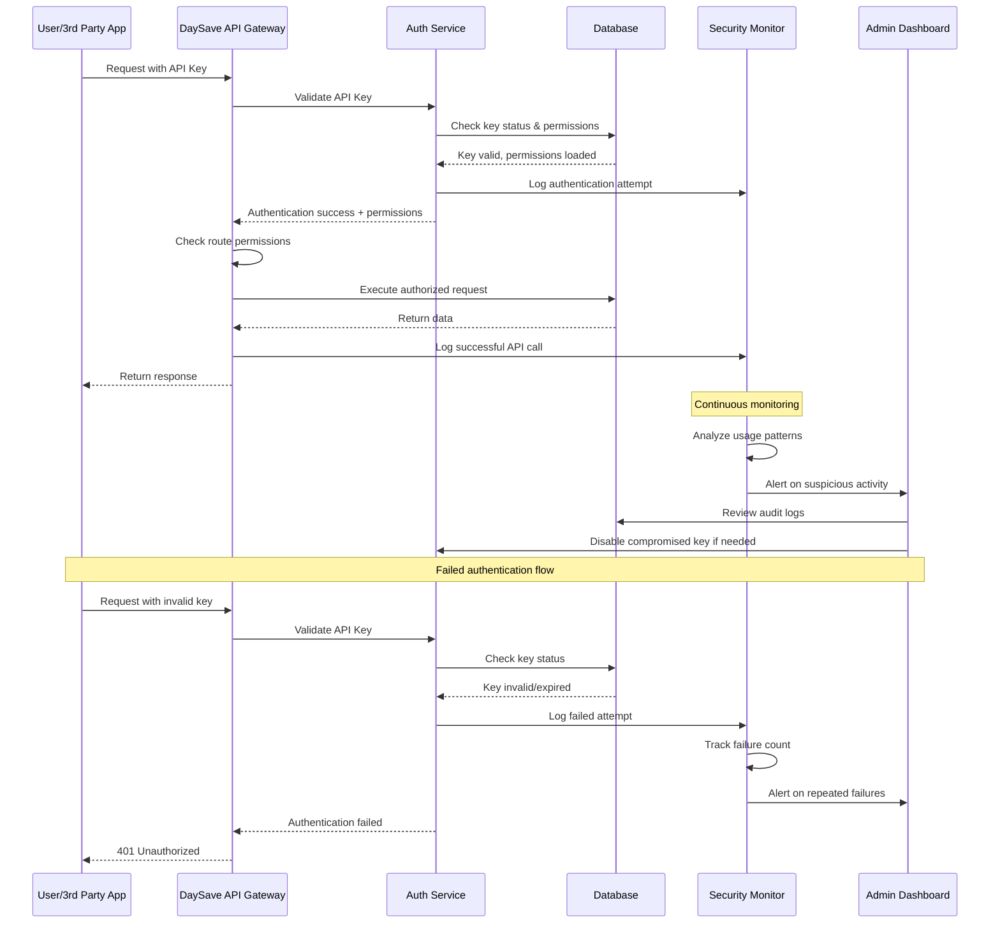

# API Security Sequence Diagram

## API Key Authentication and Security Flow

This document contains the sequence diagram for the API key authentication and security monitoring system in DaySave v1.4.1.

### System Components

- **User/3rd Party App**: External applications using DaySave APIs
- **API Gateway**: Main entry point for all API requests
- **Auth Service**: Authentication and authorization service
- **Database**: Data storage and key validation
- **Security Monitor**: Real-time monitoring and threat detection
- **Admin Dashboard**: Administrative oversight and management

### Authentication Flow

### Security Features

#### **Real-time Monitoring**
- Continuous analysis of API usage patterns
- Anomaly detection for unusual request patterns
- Geographic monitoring for access from unexpected locations
- Rate limiting enforcement and violation tracking

#### **Audit Trail**
- Complete logging of all authentication attempts
- Detailed tracking of API key usage and performance
- Failed attempt monitoring with automatic alerting
- Administrative action logging for key management

#### **Threat Response**
- Automatic key disabling on suspicious activity
- Real-time alerts to administrators
- Comprehensive forensic logging for investigation
- Integration with security monitoring systems

### Implementation Notes

- All API keys are stored as bcrypt hashes in the database
- Rate limiting is enforced per key with configurable limits
- Failed authentication attempts trigger progressive security measures
- Administrative actions are logged and require proper authorization
- The system supports both automatic and manual key rotation

### Related Documentation

- [API Key Management Specifications](../DaySave.app.md#api-key-management)
- [Security Implementation Guide](./security-implementation.md)
- [Admin Dashboard Features](./admin-features.md)

---

**Document Information**:
- **Created**: January 2025
- **Version**: 1.4.1
- **Last Updated**: January 2025
- **Author**: DaySave Development Team
- **Status**: Current Implementation Plan 