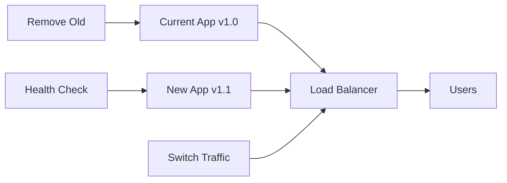

# DaySave VM Production Deployment Guide

## 🎯 **Complete VM Deployment with SSL & Zero-Downtime Updates**

This guide covers deploying DaySave to Google Compute Engine VMs with **your own MySQL database**, **Let's Encrypt SSL/TLS**, and **zero-downtime deployment strategy**.

---

## 📋 **Prerequisites**

### **Local Requirements**
- Google Cloud SDK (`gcloud`) installed and configured
- Docker and Docker Compose installed
- Domain name pointing to your future VM IP
- Production environment variables ready

### **Google Cloud Setup**
- Google Cloud Project with billing enabled
- Required APIs enabled:
  - Compute Engine API
  - Container Registry API
  - Cloud Storage API
  - Speech-to-Text API
  - Vision API

---

## 🚀 **Quick Start Deployment**

### **Step 1: Configure Your Domain and Credentials**

1. **Update configuration files** with your actual domain:
   ```bash
   # Edit these files and replace 'your-domain.com' with your actual domain
   nano scripts/deploy-production.sh  # Update DOMAIN variable
   nano nginx/sites-available/daysave.conf  # Update server_name
   ```

2. **Create production environment file**:
   ```bash
   cp .env.example .env.production
   nano .env.production  # Fill in your production values
   ```

### **Step 2: Run Complete Deployment**

```bash
# Make scripts executable
chmod +x scripts/deploy-production.sh
chmod +x scripts/update-production.sh

# Run complete deployment (this takes 15-20 minutes)
./scripts/deploy-production.sh full
```

This single command will:
- ✅ Create Google Cloud service account
- ✅ Create and configure VM instance
- ✅ Install Let's Encrypt SSL certificates
- ✅ Build and deploy Docker containers
- ✅ Setup monitoring and automated backups

---

## 🔐 **Let's Encrypt SSL/TLS Setup**

### **How It Works**
1. **Nginx** acts as reverse proxy and SSL termination
2. **Let's Encrypt** provides free SSL certificates
3. **Automatic renewal** via cron job (coming soon)
4. **HTTPS redirect** forces secure connections

### **Certificate Management**

#### **Initial Certificate Setup**
```bash
# Certificates are automatically created during deployment
# If you need to manually create/renew:

./scripts/deploy-production.sh ssl
```

#### **Certificate Renewal** (Manual for now)
```bash
# SSH into your VM
gcloud compute ssh daysave-production --zone=asia-southeast1-a

# Renew certificates
sudo certbot renew

# Reload nginx
docker-compose exec nginx nginx -s reload
```

#### **Certificate Auto-Renewal** (Future Enhancement)
```bash
# Add to VM crontab (will be automated in future version)
0 12 * * * /usr/bin/certbot renew --quiet && docker-compose exec nginx nginx -s reload
```

---

## ⚡ **Zero-Downtime Deployment Strategy**

### **Blue-Green Deployment Process**

Our deployment uses **blue-green strategy** to ensure zero downtime:



### **Deployment Steps**

1. **Backup Current State**
   - Database backup to Cloud Storage
   - Current image tag saved for rollback

2. **Build New Image**
   - Docker image built locally
   - Pushed to Google Container Registry

3. **Blue-Green Deploy**
   - New container started alongside current
   - Health checks performed
   - Traffic switched to new container
   - Old container removed

4. **Verification**
   - Application health checks
   - Database connectivity tests
   - Error log analysis

### **Update Production**

```bash
# Zero-downtime update (takes 3-5 minutes)
./scripts/update-production.sh deploy

# Check deployment status
./scripts/update-production.sh health-check

# View logs if needed
./scripts/update-production.sh logs

# Rollback if necessary
./scripts/update-production.sh rollback gcr.io/daysave-v1412/daysave:20240123-143052
```

---

## 🏗️ **Architecture Overview**

### **Production Infrastructure**

```
┌─────────────────────────────────────────────────────┐
│                 Google Compute Engine VM            │
├─────────────────────────────────────────────────────┤
│  ┌─────────────┐  ┌─────────────┐  ┌─────────────┐  │
│  │   Nginx     │  │   DaySave   │  │   MySQL     │  │
│  │ (SSL Term.) │→ │    App      │→ │  Database   │  │
│  │   Port 443  │  │  Port 3000  │  │  Port 3306  │  │
│  └─────────────┘  └─────────────┘  └─────────────┘  │
│  ┌─────────────┐                                    │
│  │   Redis     │                                    │
│  │  (Cache)    │                                    │
│  │  Port 6379  │                                    │
│  └─────────────┘                                    │
├─────────────────────────────────────────────────────┤
│  Google Cloud Service Account (Auto Authentication) │
└─────────────────────────────────────────────────────┘
```

### **Security Features**

- 🔒 **SSL/TLS Encryption** - All traffic encrypted with Let's Encrypt
- 🛡️ **Security Headers** - HSTS, CSP, XSS protection
- 🚫 **Rate Limiting** - API and authentication endpoint protection
- 🔐 **Container Security** - Non-root user, capability dropping
- 🗝️ **Service Account** - No credential files, Google-managed authentication

---

## 📊 **Monitoring & Maintenance**

### **Health Monitoring**

```bash
# Application health endpoint
curl https://your-domain.com/health

# Detailed system status
gcloud compute ssh daysave-production --zone=asia-southeast1-a --command="
  docker-compose ps
  docker stats --no-stream
  df -h
  free -h
"
```

### **Log Management**

```bash
# Application logs
./scripts/update-production.sh logs

# System logs
gcloud compute ssh daysave-production --zone=asia-southeast1-a --command="
  sudo journalctl -u daysave.service -f
"

# Nginx logs
gcloud compute ssh daysave-production --zone=asia-southeast1-a --command="
  docker-compose logs nginx -f
"
```

### **Database Backups**

```bash
# Manual backup
gcloud compute ssh daysave-production --zone=asia-southeast1-a --command="
  docker-compose exec -T db mysqldump -u root -p\$DB_ROOT_PASSWORD daysave_v141 > backup_\$(date +%Y%m%d).sql
  gsutil cp backup_\$(date +%Y%m%d).sql gs://daysave-v1412-backups/
"

# List backups
gsutil ls gs://daysave-v1412-backups/

# Restore backup
gsutil cp gs://daysave-v1412-backups/backup_20240123.sql .
docker-compose exec -T db mysql -u root -p\$DB_ROOT_PASSWORD daysave_v141 < backup_20240123.sql
```

---

## 🔧 **Maintenance Tasks**

### **Regular Maintenance**

1. **Weekly**:
   - Review application logs for errors
   - Check disk space and performance metrics
   - Verify backup completion

2. **Monthly**:
   - Update system packages on VM
   - Review and rotate API keys
   - Performance optimization review

3. **Quarterly**:
   - Security audit and penetration testing
   - Disaster recovery testing
   - Capacity planning review

### **System Updates**

```bash
# Update VM system packages
gcloud compute ssh daysave-production --zone=asia-southeast1-a --command="
  sudo apt update && sudo apt upgrade -y
  sudo reboot
"

# Update Docker images
./scripts/update-production.sh deploy
```

---

## 🚨 **Troubleshooting**

### **Common Issues**

#### **SSL Certificate Issues**
```bash
# Check certificate status
gcloud compute ssh daysave-production --zone=asia-southeast1-a --command="
  sudo certbot certificates
"

# Manual certificate renewal
sudo certbot renew --force-renewal -d your-domain.com
```

#### **Container Issues**
```bash
# Check container status
docker-compose ps

# Restart specific service
docker-compose restart app

# View container logs
docker-compose logs app --tail=100
```

#### **Database Connection Issues**
```bash
# Test database connectivity
docker-compose exec db mysql -u root -p$DB_ROOT_PASSWORD -e "SELECT 1"

# Check database status
docker-compose exec db mysqladmin -u root -p$DB_ROOT_PASSWORD status
```

### **Emergency Procedures**

#### **Complete Rollback**
```bash
# Rollback to previous version
./scripts/update-production.sh rollback gcr.io/daysave-v1412/daysave:previous-tag

# Restore database backup
gsutil cp gs://daysave-v1412-backups/pre_update_backup_YYYYMMDD.sql .
docker-compose exec -T db mysql -u root -p$DB_ROOT_PASSWORD daysave_v141 < pre_update_backup_YYYYMMDD.sql
```

#### **Service Recovery**
```bash
# Emergency restart all services
gcloud compute ssh daysave-production --zone=asia-southeast1-a --command="
  docker-compose down
  docker-compose up -d
"
```

---

## 📈 **Performance Optimization**

### **Recommended VM Specifications**

| Users | VM Type | CPU | RAM | Disk | Est. Cost/Month |
|-------|---------|-----|-----|------|----------------|
| 1-100 | e2-standard-2 | 2 vCPU | 8GB | 50GB | $50-80 |
| 100-500 | e2-standard-4 | 4 vCPU | 16GB | 100GB | $120-160 |
| 500-1000 | e2-standard-8 | 8 vCPU | 32GB | 200GB | $250-350 |

### **Performance Monitoring**

```bash
# Monitor resource usage
gcloud compute ssh daysave-production --zone=asia-southeast1-a --command="
  docker stats --no-stream
  top -bn1 | head -20
  iostat -x 1 3
"
```

---

## 🔒 **Security Checklist**

### **Pre-Production Security**
- [ ] SSL certificates configured and working
- [ ] All default passwords changed
- [ ] Security headers enabled in nginx
- [ ] Rate limiting configured
- [ ] Firewall rules properly configured
- [ ] Container security hardening applied
- [ ] Regular backup strategy implemented

### **Post-Deployment Security**
- [ ] Vulnerability scanning performed
- [ ] Access logs monitored
- [ ] Intrusion detection configured
- [ ] Regular security updates scheduled
- [ ] Incident response plan documented

---

## 🎉 **Success Criteria**

After successful deployment, you should have:

✅ **HTTPS website** accessible at your domain  
✅ **Zero-downtime updates** working via blue-green deployment  
✅ **Automated backups** to Cloud Storage  
✅ **Monitoring and logging** operational  
✅ **SSL certificates** auto-renewed  
✅ **Production-grade security** implemented  

Your DaySave application is now running in a production-ready environment with enterprise-grade security, monitoring, and deployment practices! 🚀 